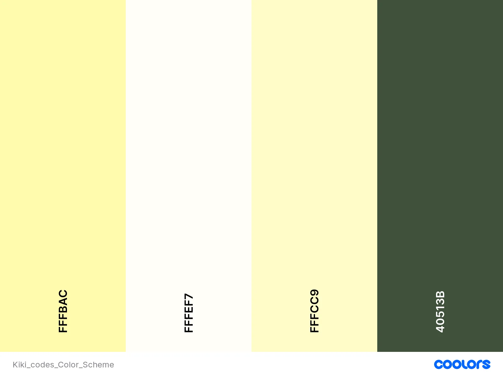
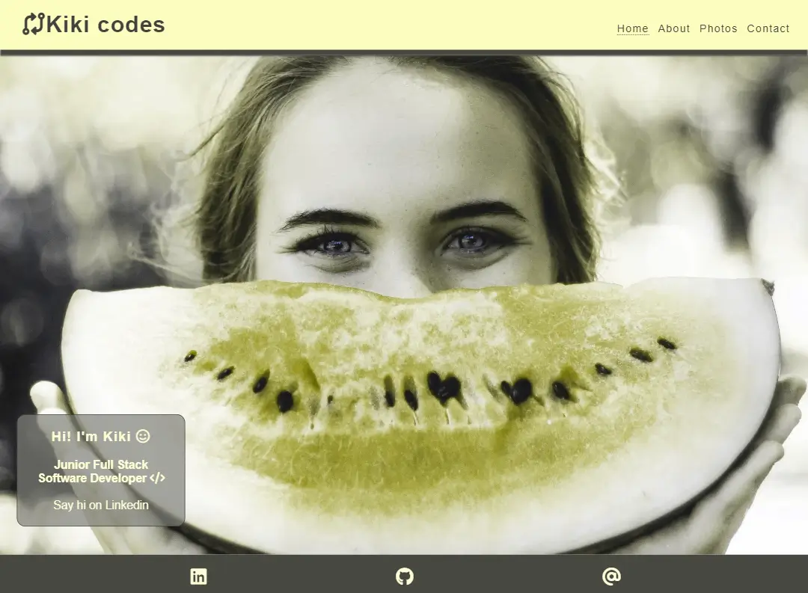
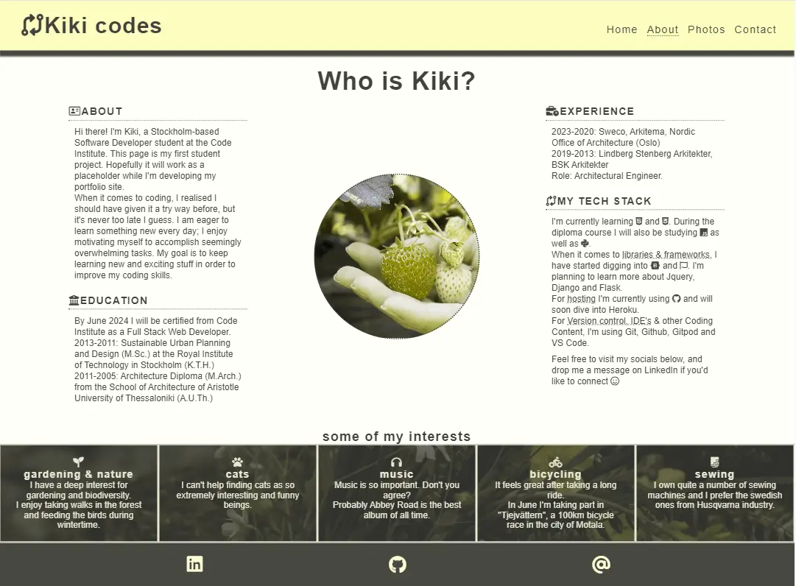
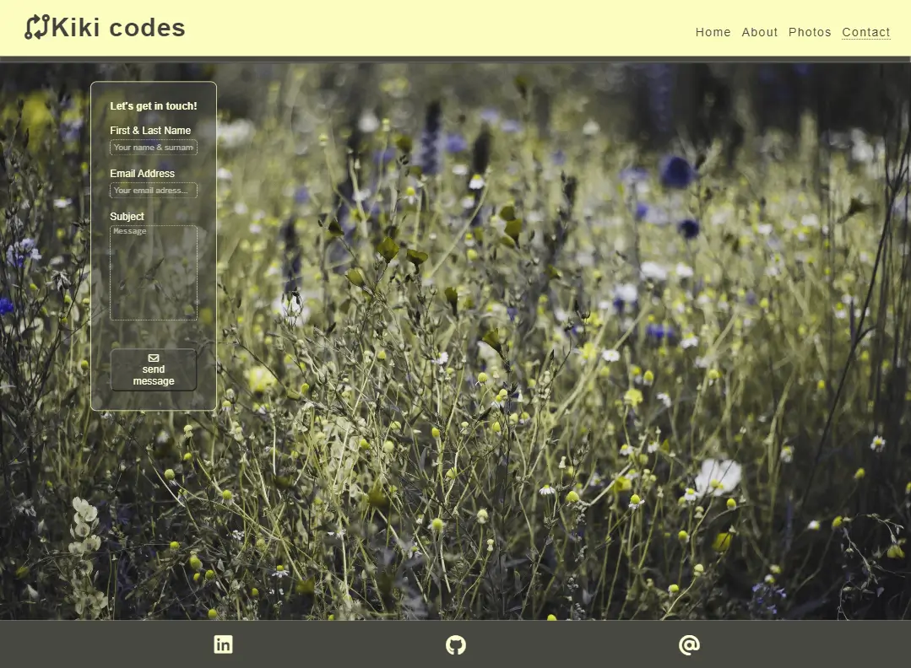

# Kiki codes

Visit the deployed site: [Kiki codes](https://kikiberg.github.io/Kikicodes/)

This page is my first student project. 
Hopefully it will work as a placeholder while I'm developing my portfolio site.

## CONTENTS

* [User Experience](#user-experience-ux)
  * [User Stories](#user-stories)

* [Design](#design)
  * [Colour Scheme](#colour-scheme)
  * [Typography](#typography)
  * [Imagery](#imagery)
  * [Wireframes](#wireframes)
  * [Features](#features)
    * [The Home Page](#the-home-page)
    * [The About Page](#the-about-page)
    * [The Photos Page](#the-photos-page)
    * [The Contact Page](#the-contact-page)
    * [Future Implementations](#future-implementations)
  * [Accessibility](#accessibility)

* [Technologies Used](#technologies-used)
  * [Languages Used](#languages-used)
  * [Frameworks, Libraries & Programs Used](#frameworks-libraries--programs-used)

* [Deployment & Local Development](#deployment--local-development)
  * [Deployment](#deployment)
  * [Local Development](#local-development)
    * [How to Fork](#how-to-fork)
    * [How to Clone](#how-to-clone)

* [Testing](#testing)

* [Credits](#credits)
  * [Code Used](#code-used)
  * [Content](#content)
  * [Media](#media)
  * [Acknowledgments](#acknowledgments)

- - -

## User Experience (UX)

I wanted to create an online portfolio about myself.

### User Stories

#### First Time Visitor Goals

* I want to make it interesting enough for possible future employers to see.
* I want the site to be responsive for different device sizes.
* I want the site to be easy to navigate.

#### Returning and frequent Visitor Goals

* I want to be able to see updates (news page) about Kiki's fulfillments.

- - -

## Design

### Colour Scheme

As I make use of background images for 3 out of 4 pages, I wanted to keep the colour scheme used on the site coherent and 
straightforward so as to not overwhelm users. Green and yellow are typical colours we associate with nature and outdoors and as I wanted to present myself and my interests I used relevant colors.

* I have used `#FFFCC9` & `#40513B` as the primary and secondary colours used for the sites text.
* I have used `#FFFEF7` as the overlay used over the sites background image.
* I have used `#FFFBAC` for the header.
* I have used `#40513B` for the footer.

  

### Typography

Google Fonts was used to import the chosen fonts for use in the site.

I have used the google font [Open Sans](https://fonts.google.com/specimen/Open+Sans?query=open+sans). The reasons I chose this one is:
* its clean and modern sans-serif typeface.
* it is comprehensible in both small and huge sizes.
* it is simple and makes the content easily readable.

### Imagery

As the website is called Kiki codes, I wanted to make the coding theme stand out by using icons related to coding.

### Wireframes

Wireframes were created for mobile, tablet and desktop using balsamiq.

### Features

The website is comprised of a home page, an about page, a photos page & a contact page.

All Pages on the website are responsive and have:

* A favicon in the browser tab.

* The title of the site at the top of every page. This title also acts as a link back to the home page.

* Every page will display as dotted and underlined when there is a hovering. This feature is available only on larger devices.

#### The Home Page

The home page of Kiki codes displays the site's name as a title, an image in the background and then a container which holds some Hi text.

#### The About Page

The about page displays the sites name as a title. There are two sections ............

#### The Photos Page

The photos page displays the sites name as a title............

#### The Contact Page

The contact page displays the sites name as a title............

#### Future Implementations

In future implementations I would like to:

1. Add one more page that will include any updates and news about Kiki's fulfillments.
2. Look further into the accessibility for people with colour blindness, perhaps by adding more symbols for checking or hovering.

### Accessibility

I have tried during coding to ensure that the website is as accessible friendly as possible. This has been have achieved by:

* Using semantic HTML, like section, nav, main, header, footer elements.
* Using a hover state on all buttons on the site to make it clear to the user if they are hovering over a button.
* Choosing a sans serif font for the site - these fonts are suitable for people with dyslexia.
* I looked into red/green colour blindness. I used the chrome extension [Web Disability Simulator](https://chrome.google.com/webstore/detail/web-disability-simulator/olioanlbgbpmdlgjnnampnnlohigkjla) to be able to see what someone with red/green colour blindness would see.

- - -

## Technologies Used

### Languages Used

HTML, CSS

### Frameworks, Libraries & Programs Used

* [Font Awesome](https://fontawesome.com/) - Used for the icons.

* [Balsamiq](https://balsamiq.com/) - Used to create wireframes.

* [Git](https://git-scm.com/) - For version control.

* [Github](https://github.com/) - To save and store the files for the website.

* [GitPod](https://gitpod.io/) - IDE used to create the site.

* [Google Fonts](https://fonts.google.com/) - To import the fonts used on the website.

* [Google Developer Tools](https://developers.google.com/web/tools) - To troubleshoot and test features, solve issues with responsiveness and styling.

* [TinyPNG](https://tinypng.com/) To compress images

* [Birme](https://www.birme.net/) To resize images and convert to webp format.

* [Favicon.io](https://favicon.io/) To create favicon.

* [Am I Responsive?](http://ami.responsivedesign.is/) To show the website image on a range of devices.

* [Shields.io](https://shields.io/) To add static badges to the README

* [Web Disability Simulator](https://chrome.google.com/webstore/detail/web-disability-simulator/olioanlbgbpmdlgjnnampnnlohigkjla) - a google chrome extension that allows you to view your site as people with accessibility needs would see it.

* [Webpage Spell-Check](https://chrome.google.com/webstore/detail/webpage-spell-check/mgdhaoimpabdhmacaclbbjddhngchjik/related) - a google chrome extension that allows you to spell check your webpage. Used to check the site and the readme for spelling errors.

- - -

## Deployment & Local Development

### Deployment

The site is deployed using GitHub Pages - [Kiki codes](https://kikiberg.github.io/Kikicodes/).

To Deploy the site using GitHub Pages:

1. Login (or signup) to Github.
2. Go to the repository for this project, [KikiBerg/Kikicodes](https://github.com/KikiBerg/Kikicodes).
3. Click the settings button.
4. Select pages in the left hand navigation menu.
5. From the source dropdown select main branch and press save.
6. The site has now been deployed, please note that this process may take a few minutes before the site goes live.

### Local Development

#### How to Fork

To fork the repository:

1. Log in (or sign up) to Github.
2. Go to the repository for this project, [KikiBerg/Kikicodes](https://github.com/KikiBerg/Kikicodes)
3. Click the Fork button in the top right corner.

#### How to Clone

To clone the repository:

1. Log in (or sign up) to GitHub.
2. Go to the repository for this project, [KikiBerg/Kikicodes](https://github.com/KikiBerg/Kikicodes)
3. Click on the code button, select whether you would like to clone with HTTPS, SSH or GitHub CLI and copy the link shown.
4. Open the terminal in your code editor and change the current working directory to the location you want to use for the cloned directory.
5. Type 'git clone' into the terminal and then paste the link you copied in step 3. Press enter.

- - -

## Testing

Please refer to [TESTING.md](TESTING.md) file for all testing carried out.

- - -

## Credits

### Code Used

* I used "Love running" walkthrough material to get help constructing my initial project.

### Content

* All the text content was written by myself. 

### Media

* [Pexels](https://www.pexels.com/) and [Unsplash](https://unsplash.com/) were used for all images.

### Acknowledgments

I would like to acknowledge the following people:

* Jubril Akolade - My Code Institute Mentor.

* The Tutor support from Code Institute for assisting and explaining.

* The Code Institute Slack channel Peer Code Review - Thank you to everyone who took the time to review my project and look over the code.

* My fellow co-student Efi (https://github.com/EfthymiaKakoulidou) for giving me feedback and reviewing my project.